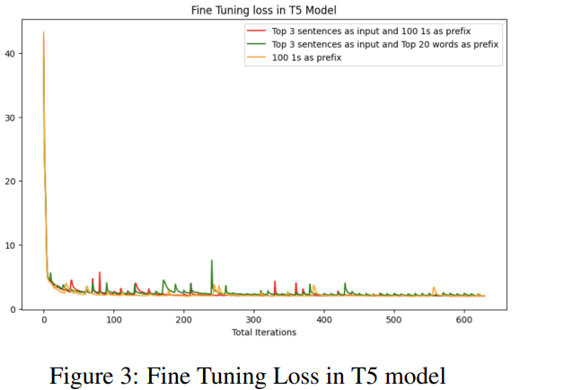

# `Soft Prompt Guided Abstractive Summarization`

GPT-2 and T-5 for Generating Abstractive summary

## Objective :
    Soft prompt-based approach for abstractive summarization using extractive summary as input.

## Requirement
* pip install -r requrement.txt

## Technologies Used
* Python 
* PyTorch
* Django

## Model 

* Prompt tuning :
    Prompt tuning with soft prompt technique that involves fine-tuning language models, such as GPT-2 and T-5. Here, the pretrained model parameters are frozon or kept-fixed while others are updated druing training with new data.  This approach are mainly used in conjunction with prompt tuning to fine-tune specific part of the model for specific taks while maintaining the pre-trained knowledge of the rest of the model. 
    

    Frozen parameter prompt tuning can be especially useful when the task-specific data is limited, or when fine-tuning the entire model with new data may result in overfitting. By freezing some of the parameters in the model, the model can retain its pre-trained knowledge and continue to perform well on tasks that require the use of this knowledge.

* GPT-2 :
    Prompt tuning technique we have used in our approach is for fine-tuning the GPT-2 model for text summarization text by providing it with a prompts that guide its generation of summaries. The prompt like Top-20 important keywords from each sample or Top-k important sentences from each sample or 100-1 prompt that are relevant to the content to be summarized.
    Prompt tuning on GPT-2 for summarization tasks can also be performed with small amounts of additional training data, making it a cost-effective way to fine-tune language model for specific tasks. We belive that getting a right prompt with a appropriate amount of few-shot can add valuable improvement on summarization tasks.

* T5- small :
    Prompt tuning on T5-model for summarization task involves fine-tuning the T-5 small language model for summarizing text. for summarizing the text we are providing a prompts that guide the model for generation of summaries, similar to prompt-tuning on GPT-2.
    Prompt tuning on T5 model for summarization also involves small amount of additional training data, making it a cost-effective way to fine-tune language model for specific tasks. One of the advantages of using T5- model is that it has ability to generate both abstractive and extractive summaries. We belive that getting a right prompt with a approapriate amount of few-shot can improve the accuracy and efficienty of summarization models and we can get better summary.

## Experiment:

* 100_1 prefix with 500 sample from Xsum dataset with GPT-2 and T-5:
    In this experiment we have taken 100_1 prefix to make a soft prompt and it is concatnated source document of 500 sample from xsum dataset to both GPT-2 and T-5 language model.
    

    In our experiment we can see:
    |100_1_prefix_500_sample| GPT-2||||
    |100_1_prefix_500_sample|T-5 |0.390160|0.291566|0.384393|

* Top 20 keywords with Top 3 sentences:
    In this experiment we have taken 20 keywords from each sample from xsum dataset. for keywords we used spacy model to indentify the important keywords. and for identify the top 3 important sentences we have used Bertsum model. 
    

    In our experiment, we can see:
    |Top_20_keywords_with_Top_3_sentences| GPT-2|0.000498|0.000000|0.000498|
    |Top_20_keywords_with_Top_3_sentences|T-5 |0.390160|0.291566|0.384393|

* 100_1 as prefix with top 3 importance sentences:
    In this experiment we have taken 100_1 prefix to make a soft prompt and it is concatnated top 3 importances sentences  from xsum dataset. to identify the top 3 importance sentences we use Bertsum and fitted to both GPT-2 and T-5 language model.
    

    In our experiment we can see:
    |Method| Model | R-1|R-2|R-L|
    |100_1_prefix_with_top_3_imp_sentences| GPT-2|0.004243|0.000000|0.004243|
    |100_1_prefix_with_top_3_imp_sentences|T-5 |0.269796|0.154264|0.260666|

## Fine-tuning Loss Result:
* fine-tune loss result graph of GPT-2 :

figure above shows that for the same number of training sample i.e 5 and same number of iteration and batch_size i.e 100 iteration and 8 batch size. we can see 100_1 prefix with 500 sample and 100_1 as prefix with top 3 setences have compitative loss graph.

* fine-tune loss result graph of T-5 :

figure above shows that for the same number of training sample and same number of iteration and batch size: 100 iteration and 8 batch size we have got all the compitative result.

## conclusion:

